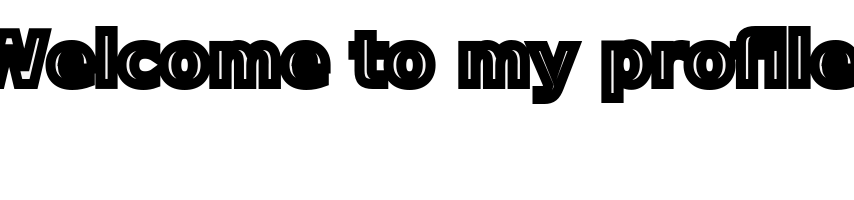

<!--
There are some material websites for DIY homepages.
1.[emojis表情包网站]https://www.emojiall.com/zh-hans/all-emojis
2.[github的统计卡片]https://github.com/anuraghazra/github-readme-stats
3.[标签样式素材网站]https://shields.io
4.[svg简易图标素材]https://simpleicons.org
5.[动态奖杯素材]https://github.com/ryo-ma/github-profile-trophy
6.[颜文字素材网站]https://symbols.wisdom-life.in/zh-CN/emoticon
-->
<!--
There are some material websites for DIY homepages.
1.[emojis表情包网站]https://www.emojiall.com/zh-hans/all-emojis
2.[github的统计卡片]https://github.com/anuraghazra/github-readme-stats
3.[标签样式素材网站]https://shields.io
4.[svg简易图标素材]https://simpleicons.org
5.[动态奖杯素材]https://github.com/ryo-ma/github-profile-trophy
6.[颜文字素材网站]https://symbols.wisdom-life.in/zh-CN/emoticon
-->

<!-- Your title -->

  <h3>
    Hi there 👋 , I'm HU ZHIPENG
    
  </h3>

<!--   Contact Me -->    

<!-- 同一行，不自动换行；可按需要在外层再包 
 -->
<!-- Github徽章链接 & 个人Github主页跳转链接-->

<!-- Gmail徽章链接 & 个人Gmail的填充链接 -->

<!-- CSDN徽章链接 & 个人CSDN主页跳转链接 -->

<!-- QQ mail徽章链接 & 个人QQ mail的填充链接 -->

<!--   my-header-img -->

**Self-introduction:** 
<!-- 自我简介-->
I thrive on getting deeply involved in my work, and whenever I’m learning something new, I instinctively help others solve related problems along the way. Ask me what’s even more exciting? Rolling up my sleeves and getting hands-on—whether that’s DIYing a black-tech gadget or building a practical embedded device. It’s not only a fantastic way to learn, but also turns every wild idea into a real, tangible creation. And that’s endlessly fun.

我非常乐于投入工作，并且我经常在学习新的知识的时候顺手帮助他人解决与此相关问题。如果你问我还有什么比这更有趣？那一定是动手实践，比方说DIY一些黑科技小工具、自制一些实用的嵌入式产品等，这不仅可以学习到许多有趣的东西而且还能把属于自己脑洞的东西变成真实存在的物品，这非常有趣。

<!-- Any image aligned to the right. Beware the width -->

- 👯 I previously worked in medical-device and water-sensor industries;
- 👨🏽‍💻 I’m currently working on [CPR-Assessment-Comprehensive-Training-System](https://github.com/young-nights/CPR-Assessment-Comprehensive-Training-System);
- 🌱 I’m currently learning Linux and Visual image recognition; 
- 💬 Ask me about anything, I am happy to help;
- 👯 I’m currently seeking like-minded partners to build something great together.🤝

  

**Languages and Tools:** 

<!-- Your github readme stats
You can use this api: https://github.com/anuraghazra/github-readme-stats
-->
<!-- 第一行：GitHub Stats 卡片（右） -->

  

<!-- Your languages and tools. Be careful with the alignment. 
You can use this sites to get logos: https://www.vectorlogo.zone or https://simpleicons.org/
-->
<!-- 第一行：4×3 技能图标区（左） -->

  
  
  
   

  
  
  
   

  
  
  
   

  
  
  

  

<!--   my-ticker -->    

